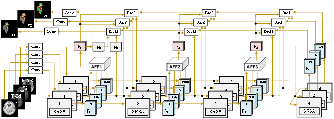
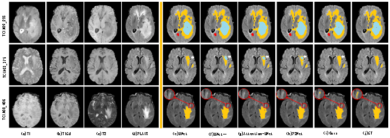
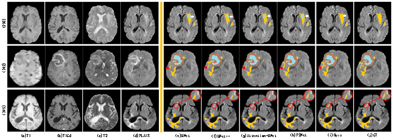

multiPI-TransBTS: A Multi-Path Learning Framework for Brain Tumor Image Segmentation Based on Multi-Physical Information

> **Authors:**
>
> *Hongjun Zhu*,
> *Jiaohang Huang*,
> *Xuehui Ying*,
> and *Kuo Chen*,
>
> 

## 1. Overview

### 1.1. Introduction

Brain Tumor Segmentation (BraTS) is crucial for clinical diagnosis, treatment planning, and monitoring the progression of brain tumors. However, due to the variability in tumor appearance, size, and intensity across different MRI modalities, automated segmentation remains a challenging task. In this study, we propose a novel Transformer-based framework, multiPI-TransBTS, which integrates multi-physical information to enhance segmentation accuracy. The model leverages spatial information, semantic information, and multi-modal imaging data, addressing the inherent heterogeneity in brain tumor characteristics.
The multiPI-TransBTS framework consists of an encoder, an Adaptive Feature Fusion (AFF) module, and a multi-source, multi-scale feature decoder. The encoder incorporates a multi-branch architecture to separately extract modality-specific features from different MRI sequences. The AFF module fuses information from multiple sources using channel-wise and element-wise attention, ensuring effective feature recalibration. The decoder combines both common and task-specific features through a Task-Specific Feature Introduction (TSFI) strategy, producing accurate segmentation outputs for Whole Tumor (WT), Tumor Core (TC), and Enhancing Tumor (ET) regions.
Comprehensive evaluations on the BraTS2019 and BraTS2020 datasets demonstrate the superiority of multiPI-TransBTS over existing state-of-the-art methods. The model consistently achieves better Dice coefficients, Hausdorff distances, and Sensitivity scores, highlighting its effectiveness in addressing the BraTS challenges. Our results also indicate the need for further exploration of the balance between precision and recall in the ET segmentation task. The proposed framework represents a significant advancement in BraTS, with potential implications for improving clinical outcomes for brain tumor patients.

### 1.2. Framework Overview

      
    <em>
    Figure 1: Framework of multiPI-TransBTS. This framework consists of three main modules: an encoder, a fusion module, and a decoder. To simplify feature representation, features are divided into common features shared across tasks and individual features specific to each task, denoted by red and blue F-marked blocks, respectively. "SRSA" indicates Spatial-Reduction Self-Attention module. "AFF" and "FE" stand for adaptive 
    </em>

### 1.3. Qualitative Results

      
    <em> 
    Figure 2: Qualitative Results.
    </em>

      
    <em> 
    Figure 2: Qualitative Results.
    </em>

## 2. Proposed Method

### 2.1. Training/Testing

The training and testing experiments are conducted using [PyTorch](https://github.com/pytorch/pytorch) with one NVIDIA RTX A4000 GPU.

1. Configuring your environment (Prerequisites):
       
    + Installing necessary packages: `pip install -r requirements.txt`.

2. Downloading necessary data:

    + downloading BraTS 2020 dataset
    which can be found from [Here](https://www.med.upenn.edu/cbica/brats2020/data.html).
    
    + downloading PVTv2 weights and move it into `./networks/pretrained_pth/pvt_v2_b2.pth`,
    which can be found from [GitHub](https://github.com/whai362/PVT/releases/download/v2/pvt_v2_b2.pth).

3. Preprocessing:

    + Before training, the dataset must be preprocessed, just run `python dateset_preprocess.py`. We provide the train 
    dataset validation dataset and test dataset in `./data/train_list.txt` `./data/val_list.txt` and `./data/train_list.txt`.
4. Training:
    
    + After processing training dataset, just run `python train.py --modalities all --model multiPI-TransBTS --batch_size 12` to train our model.
      (you can set your parameters when running the code.)

**[⬆ back to top](#1-preface)**
